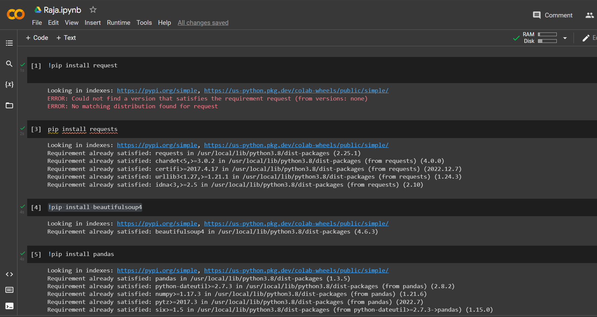
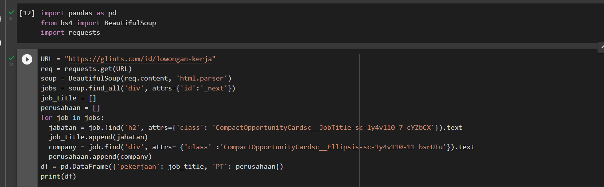
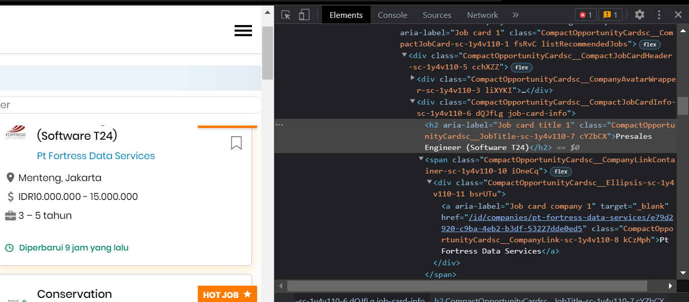

# praktikum11

```
raja happyanto
ti.22.a2
```
## Web Scraping Menggunakan Python

##PIP

```
note : jika terjadi eror saat instal pip, silahkan pergi ke google dan gunakan ketik get pip py, lalu donwload file tsb cukup dengan copy linknya, lalu paste di script python, (penyimpanan aplikasi python)

```

#### pertama instal library lebih dulu
1. Instal Library request
2. instal Library BeautifulSoup4
3. Instal Library Pandas



#### setelahnya buat code seperti ini



#### untuk menbuat web scraping anda perlu ke website yang di inginkan lalu lalu klik kanan pada bagian yang ingin di scrab, setelah itu pilih menu inspect. seperti pada gambar



#### lalu copy atribut dan class nya. 

### selesai

```
kind regards

"Raja Happyanto"
```
